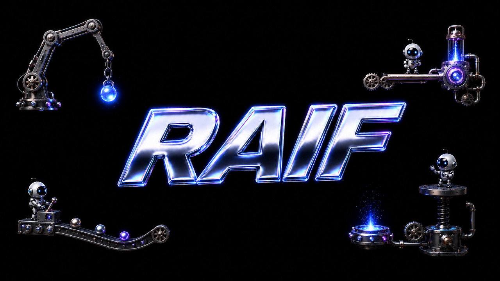

<p align="center">
  
</p>

<h1 align="center">RAIF</h1>

<p align="center"><strong>Repairable AI Interchange Format</strong></p>

<p align="center">
  A wire format for the JSON object an LLM emits for a tool call. It repairs its own<br>
  syntax errors, round-trips losslessly to JSON, and costs ~14% fewer tokens.
</p>

<p align="center">
  <a href="LICENSE"></a>
  
  
  
  <a href="https://huggingface.co/skrrt-sh/raif-llama-3.2-3b-lora"></a>
</p>

---

JSON was designed for a deterministic writer. An LLM is not one: it drops a closing
brace, wraps output in a markdown fence, or gets cut off mid-stream. Today every
production stack patches over this with regex, retries, and `jsonrepair`.

RAIF inverts the assumption. The writer is a model; the reader is an interpreter
that can **repair, validate, and canonicalize**. The format is line-oriented,
value-first, and built so that the common failure modes of generated output are
recoverable by construction.

```ts
import { encode, decode } from "@skrrt-sh/raif";

encode({ user: { name: "Ada", email: "ada@x.io" }, active: true });
// active=true
// user={email=ada@x.io,name=Ada}

decode(raif).value; // → the exact JSON object back
```

## Why not just JSON

| | JSON | RAIF |
|---|---|---|
| Token cost | baseline | **−14%** |
| Syntax-error recovery | external (`jsonrepair`), silent | built-in, every repair reported |
| Truncated output | all-or-nothing parse | per-leaf recovery (**46%** vs 41% leaves) |
| Lossless round-trip | n/a | byte-exact, canonical, 5,000-seed fuzz-proven |
| Schema-typed decode | n/a | optional — `"null"` stays the string, not `null` |

## Token cost vs other formats

Lower is better. Measured across an 18-shape corpus with the `cl100k` and `o200k`
tokenizers. Reproduce with `bun compare`.

| Format | vs JSON (cl100k) | vs JSON (o200k) |
|---|---:|---:|
| **RAIF** | **−14.4%** | **−15.9%** |
| TOON | −0.2% | −2.1% |
| YAML | +20.9% | +18.5% |

TOON and YAML are LLM-*input* formats; RAIF targets LLM *output*. The numbers above
compare only token cost on identical payloads — the repair and recovery guarantees
below are unique to RAIF.

## Capabilities

| | |
|---|---|
| **Self-healing decode** | Auto-fixes markdown fences, mode markers, and slipped `:`→`=` separators. Reports every repair; refuses ambiguous ones. Never rewrites values. |
| **Truncation recovery** | `decodeLenient` returns the intact leaves of a cut-off stream plus a per-leaf error list — 46% leaf recovery at equal token budget, vs 41% for JSON + `jsonrepair`. |
| **Lossless round-trip** | `decode(encode(x))` equals `x`, with canonical UTF-8 sort and idempotent output. Proven under a 5,000-seed fuzz test. |
| **Schema-typed decode** | An optional schema pins types: a bare `null` under a string field stays the string `"null"`. The literal-string fidelity trap is gone by construction. |
| **Dependency-light** | Pure TypeScript encoder and decoder. No runtime dependencies in the core path. |

```ts
decode("```\nactive=true\nuser.name: Ada\n```");
// ok: true, repairs: [markdown_stripped, separator_coerced]

decodeLenient("<raif>\ncity=Oslo\nlat"); // stream cut off
// { value: { city: "Oslo" }, truncated: true, errors: [{ line: 2, … }] }
```

## API

```ts
encode(obj, opts?)            // JSON object → RAIF
decode(raif, schema?)         // → { ok, value, repairs }   (repairs, then parses)
decodeLenient(raif, schema?)  // → { value, errors, truncated, repairs }   (never throws)
fix(raif, schema?)            // → canonical RAIF
validate(raif, schema?)       // read-only canonicality check
```

## Implementations

The same four-function API in two languages, kept in lockstep by a shared,
language-agnostic [conformance corpus](conformance/) generated from the reference
encoder. Both are dependency-light (zero runtime dependencies in the core path).

| Language | Package | Source | Surface |
|---|---|---|---|
| TypeScript (reference) | [`@skrrt-sh/raif`](https://www.npmjs.com/package/@skrrt-sh/raif) on npm | [`packages/js`](packages/js) | `encode` · `decode` · `decodeLenient` · `fix` · `validate` |
| Python | [`raif`](https://pypi.org/project/raif/) on PyPI | [`packages/py`](packages/py) | `encode` · `decode` · `decode_lenient` · `fix` · `validate` |

```py
from raif import encode, decode

encode({"user": {"name": "Ada"}, "active": True})
decode(raif)["value"]   # → the exact JSON object back
```

## Quick start

```sh
# TypeScript (packages/js)
cd packages/js && bun install
bun test          # 247 tests: property suite + shared conformance corpus
bun run build     # dual ESM+CJS + types

# Python (packages/py)
cd packages/py && uv sync
uv run pytest     # unit + conformance + (dev-only) differential vs the TS reference
```

Toolchains are pinned in [`mise.toml`](mise.toml) (`mise install`).

## Fine-tuned model

A Llama-3.2-3B LoRA that natively emits RAIF instead of JSON is published on
Hugging Face — it brings the token savings and truncation recovery to small,
local, and self-hosted inference:

- Model: [**skrrt-sh/raif-llama-3.2-3b-lora**](https://huggingface.co/skrrt-sh/raif-llama-3.2-3b-lora) — clears the v0.5 acceptance gate (100% / 95%)
- Agent-grade: [**skrrt-sh/raif-qwen3-4b-lora**](https://huggingface.co/skrrt-sh/raif-qwen3-4b-lora) — Qwen3-4B for real self-hosted agents (~14 GB VRAM); holdout 98% parse / 95% fidelity, clears 3/4 gate metrics with margin
- Tiny: [**skrrt-sh/raif-qwen2.5-0.5b-lora**](https://huggingface.co/skrrt-sh/raif-qwen2.5-0.5b-lora) — the same recipe on a 6×-smaller base (97% parse, 81% holdout fidelity); a study in how far a tiny local model can be pushed
- Training workstream: [**raif-lora**](https://github.com/skrrt-sh/raif-lora)

## Scope

RAIF covers a single JSON object of LLM output: strings, numbers, booleans, nulls,
arrays of those, and nested objects. It is **not** a general interchange format,
not compression, not a schema language, and not an LLM-*input* format.

## Project layout

```
docs/raif_v0.3_spec.md     base specification; the v0.5 surface = this doc + the ADRs
docs/adr/0001…0019         design decisions (the v0.5 amendments), one per file
conformance/               language-agnostic test corpus (the cross-impl contract)
packages/js/src/raif.ts    TypeScript reference encoder + decoder (pure)
packages/py/src/raif/      Python implementation (encode/decode/fix/validate)
mise.toml                  pinned toolchains (node, bun, python, uv)
CONTEXT.md                 glossary — read first
HANDOFF.md                 full project state and findings
```

## License

[Apache-2.0](LICENSE). The patent grant matters for a wire format others may
implement — anyone building on RAIF is covered.
